# Основы профессиональной деятельности, ОПД
ИТМО Программная инженерия (Нейротехнологии и программирование) 

---

## OPD_web
1) Валявина Валерия Константиновна Р3123
2) Касьяненко Вера Михайловна P3120
3) Кремпольская Екатерина Александровна Р3121
2) Лукьянчук Ярослав Евгеньевич Р3123
3) Сергеев Михаил Александрович Р3123

---

## Инструкция по запуску проекта

1. Скачайте весь проект, для этого вы, например, можете скачать его в zip формате, а затем распаковать в удобном месте

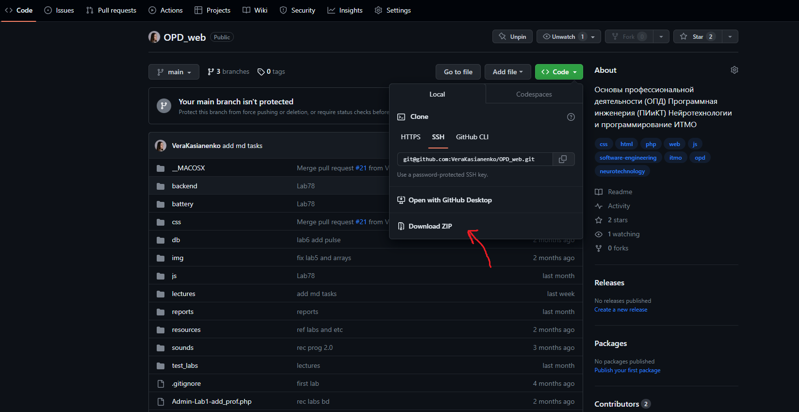

2. Скачайте MAMP по [ссылке](https://www.mamp.info/en/downloads/) и установите его

***Интерфейс в MAMP может отличаться от скриншотов, однако результат от этого не изменится***

3. Откройте MAMP, перейдите во вкладку `MAMP - Preferences`, зайдите в раздел `Ports` и поменяйте следующие настройки:
- Apache Port: `8888`
- Nginx Port: `8888`
- MySQL Port: `8889`

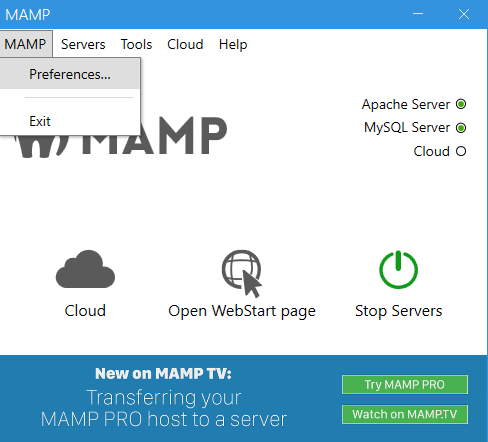

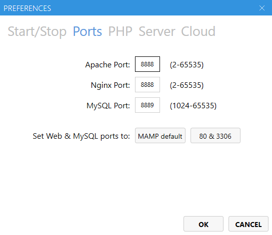

4. Здесь же зайдите в раздел `Server` и поменяйте `Document Root` на полный путь к распакованному проекту, затем нажмите OK

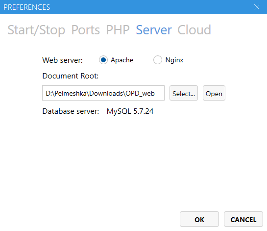

5. Перейдите в браузер и откройте [phpMyAdmin](http://localhost:8888/phpMyAdmin/)

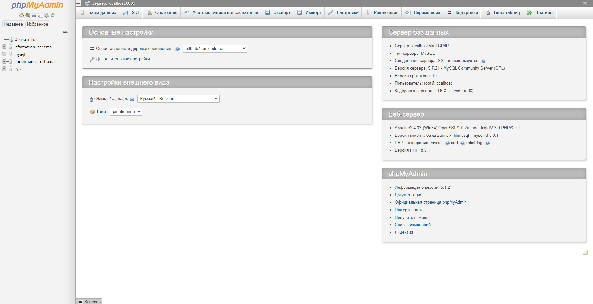

6. Нажмите на Создать БД слева

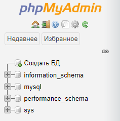

7. Введите имя базы данных `proratings`, потом нажмите `Создать`

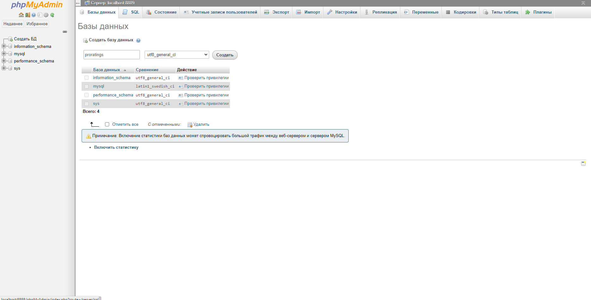

8. Сверху выберите `Импорт`, потом нажмите на `Выберите файл`, далее найдите в распакованном архиве папку `db` и файл `db.sql`, после этого нажмите внизу `Вперед`

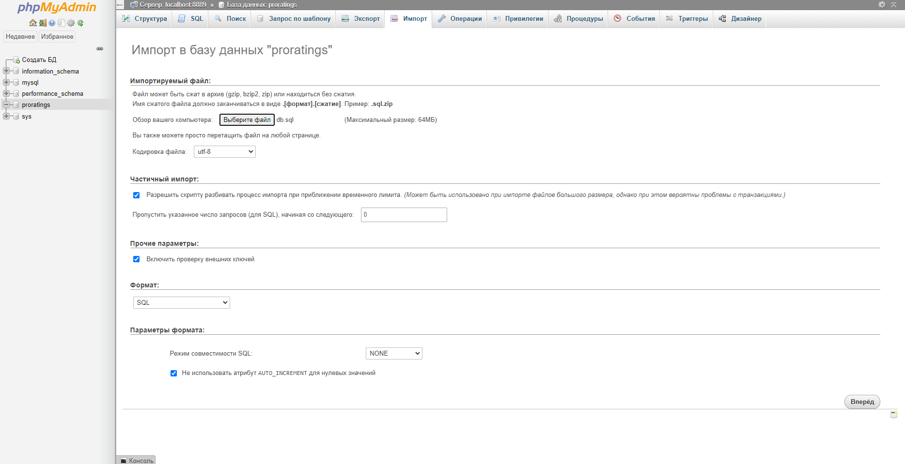

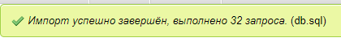

9. Если все успешно выполнено, можно пользоваться нашим [сайтом для пользователей](http://localhost:8888/) и [сайтом для админа](http://localhost:8888/admin.php)

**Примечание.** Чтобы попасть на сайт админа, предварительно надо [войти](http://localhost:8888/loginIndex.php). По умолчанию для админа
- логин: `user1`
- пароль: `admin`

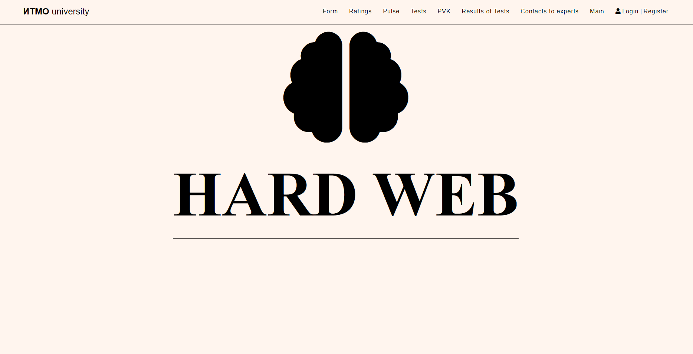

<h3>Всем удачи!</h3>

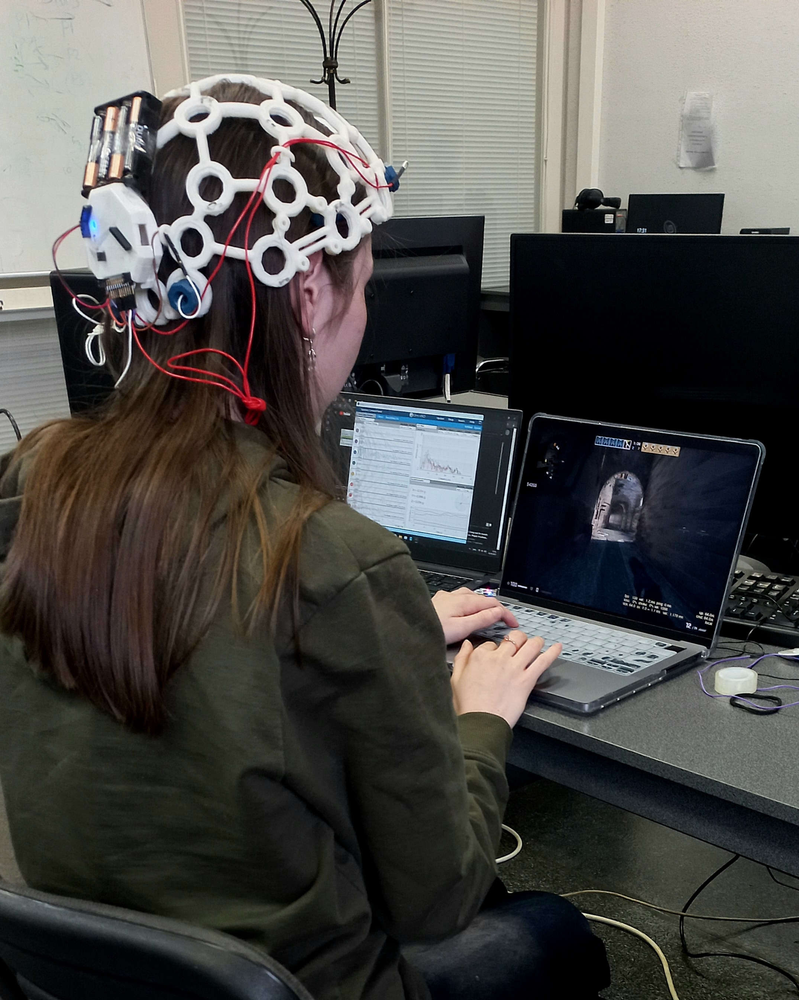
